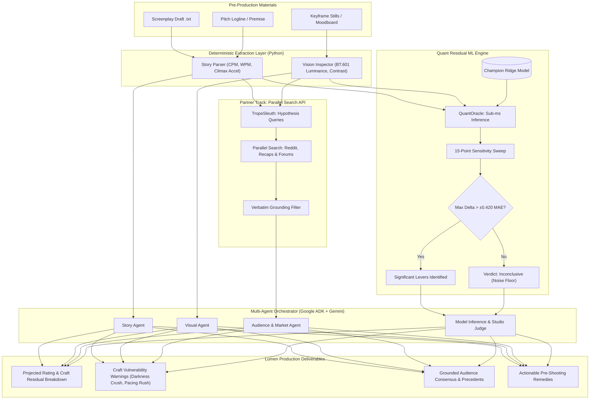

# 🎬 Lumen — Agentic Cinema Pre-Mortem Flight Simulator

> **Autonomous Multi-Agent Pre-Flight Intelligence Evaluating Unfilmed Screenplays, Visual Keyframes, and Trope Fatigue Before Cameras Roll.**
>
> *Built for [Agentic Cinema: The Blockbuster Hackathon](https://agentic-cinema.devpost.com/) — Competing in the **Parallel Partner Track** and powered by **Google Cloud & Google Gemini**.*

[](https://cloud.google.com/run)
[](https://cloud.google.com/vertex-ai)
[](https://parallel.ai)
[](https://python.org)
[](https://fastapi.tiangolo.com)
[](LICENSE)

---

## 📌 Executive Summary: The $100M Problem

In Hollywood and prestige television, studios routinely greenlight **$50M to $100M+** productions based on creative intuition. When a production misfires due to craft errors—such as lighting that is unreadable on consumer displays (*Game of Thrones: "The Long Night"*), a rushed third act that alienates audiences, or sluggish dialogue pacing—the financial and reputational loss is catastrophic. 

**You cannot un-shoot a $100M movie.**

**Lumen** is an autonomous multi-agent pre-mortem flight simulator that stress-tests unfilmed screenplays, loglines, and visual moodboards **before production begins**. Lumen evaluates observable craft features, runs deterministic sensitivity sweeps, performs live web audience research via the **Parallel Search API**, and delivers an evidence-backed studio diagnosis with counterfactual remedies.

---

## 🏛️ Architectural Mantra: "Code Owns Every Number; LLMs Own Only Language"

A core architectural tenet of Lumen is the strict separation between deterministic quantitative mathematics and generative multimodal reasoning:

```
┌────────────────────────────────────────────────────────┐
│               CODE OWNS EVERY NUMBER                   │
│  • Pacing algorithms & shot duration math              │
│  • Image luminance & BT.601 perceived exposure formulas│
│  • Scikit-learn Ridge regression & cross-validation    │
│  • 15-point counterfactual sensitivity sweeps          │
│  • Noise-floor filtering (±0.420 MAE error bar guard)  │
└───────────────────────────┬────────────────────────────┘
                            │ Structured JSON & Attributions
┌───────────────────────────▼────────────────────────────┐
│                LLMS OWN ONLY LANGUAGE                  │
│  • Multi-modal visual aesthetic interpretation         │
│  • Framing hypothesis-driven Parallel Search queries   │
│  • Grounding retrieved evidence to verbatim substrings │
│  • Synthesizing adversarial debate & producer memos    │
└────────────────────────────────────────────────────────┘
```

### Why this matters:
* **Zero Arithmetic Hallucinations:** Large language models never invent ratings, confidence intervals, or statistical percentages.
* **Zero Target Leakage:** The quantitative engine is strictly trained on pre-production observable variables (no post-release vote counts, box office numbers, or broadcast scheduling markers).
* **Noise-Floor Guard:** If suggested craft adjustments alter the expected rating by less than the cross-validation Mean Absolute Error ($\pm 0.420$ stars), the system labels the outcome as `inconclusive`, preventing misleading producers over statistical noise.

---

## 🏗️ Multi-Agent Architecture



### The 4 Presentation Tracks
1. **Story Agent**: Ingests the full screenplay to measure dialogue rhythm (WPM), cutting tempo (CPM), dialogue-to-action ratio, and Act 3 climax acceleration.
2. **Visual Agent**: Evaluates concept stills or keyframes for ITU-R BT.601 luminance, RMS contrast, and dark-frame ratio ($<40$ luminance) to flag compression crush risks.
3. **Audience & Market Agent**: Leverages the **Parallel Search API** to query live audience discussions (Reddit `r/television`, discussion threads, critic archives) for matching tropes and fatigue patterns.
4. **Model Inference & Judge**: Combines deterministic Ridge predictions with the 15-point counterfactual sensitivity sweep and an adversarial synthesis agent via Google ADK.

---

## 🌐 Partner Track: Parallel Search API Integration

Lumen competes in the **Parallel Partner Track**, implementing direct, runtime web intelligence through the **Parallel Search API** (`api.parallel.ai/v1/search`):

* **Targeted Query Formulation (`src/search/trope_sleuth.py`)**: Generates craft-directed search queries rather than generic title lookups:
  * *Darkness anomaly detected* $\rightarrow$ `"films criticized for dark cinematography compression unwatchable"`
  * *Climax rush detected* $\rightarrow$ `"movies where third act climax felt rushed audience backlash"`
  * *Dialogue deficit detected* $\rightarrow$ `"pacing dragging boring dialogue audience reception"`
* **Direct Runtime Wrapper (`src/search/parallel_search_client.py`)**: Dispatches structured requests to `api.parallel.ai/v1/search` with header `x-api-key` and body `{"search_queries": [...]}`.
* **Verbatim Grounding Filter (`filter_claims`)**: Any extracted claim is **strictly deleted** unless its `source_url` was actually returned by Parallel Search **AND** its quote evidence is a verbatim substring of the retrieved page text. Hallucinated search citations are impossible.
* **Persistent Disk Caching (`data/cache/search/`)**: SHA-256 query digests cache responses to conserve API credits during testing, with an intelligent offline mock fallback when offline.

---

## 📊 Quantitative ML Engine & 100-Movie Benchmark

Lumen's quantitative residual model is trained on a curated benchmark of **100 genuine, famous feature films** (*The Matrix*, *Alien*, *Apocalypse Now*, *Blade Runner*, *Fight Club*, etc.):

* **Zero Synthetic Data**: Every data point is derived from genuine screenplays and 752 Film-Grab widescreen cinematography stills.
* **Model Tournament**: Tested Linear Regression, Random Forest, HistGradientBoosting, and Ridge Regression.
* **Champion Model**: **Ridge Regression** ($\alpha=10.0$) with `StandardScaler`:
  * **5-Fold Cross-Validation MAE**: $\pm 0.420$ IMDb stars
  * **CV RMSE**: $0.575$ | **CV $R^2$**: $0.168$
* **Sub-Millisecond Inference**: `QuantOracle` executes predictions in **0.54 milliseconds** ($>1,800$ evaluations/sec) with pre-loaded weights from `data/models/champion_model.joblib`.
* **15-Point Sensitivity Sweep (`src/quant/sweep.py`)**: Probes 5 discrete steps across 3 independent levers:
  1. `dark_frame_ratio`: Baseline, 0.55, 0.40, 0.25, 0.10
  2. `total_duration_min`: Baseline, 165, 150, 135, 120
  3. `pacing_acceleration`: Baseline, 1.10, 1.30, 1.50, 1.75

---

## 🎯 Out-of-Corpus Validation: *Gangs of New York* Demo

To prove generalization without target leakage, Lumen includes a full out-of-corpus test package in [`data/demo/gangs_of_new_york`](data/demo/gangs_of_new_york/):

* **Title**: *Gangs of New York* (2002, dir. Martin Scorsese) — **Not in the 100-movie training set.**
* **Inputs**: 194-minute draft screenplay + 10 evenly spaced Film-Grab stills.
* **Hidden-Title Run**: Evaluated with the title replaced by `"Untitled"` and a generic logline.
* **Results**:
  * Actual IMDb Rating: **7.5**
  * Corpus Genre Prior: **7.83**
  * Lumen Projected Rating: **8.09** (Residual: $+0.26$, within the $\pm 0.420$ noise floor)
  * **Honest Diagnosis**: The system correctly flags the visual darkness risk ($50\%$ dark frames) and classifies the craft delta as inside the noise floor, accurately declaring the result **`inconclusive`** rather than claiming an overfitted hit.

---

## ☁️ Cloud & AI Stack: Google Cloud & Vertex AI

* **Model Orchestration**: **Google ADK** (`google-adk>=2.8.0`) orchestrating Gemini models.
* **LLM Engine**: **Google Gemini 3.7 / 3.8 Flash** via Google Cloud Vertex AI (`GOOGLE_GENAI_USE_VERTEXAI=true`).
* **Container Deployment**: **Google Cloud Run** (`europe-north1`) via **Google Cloud Build**.
* **Backend API**: **FastAPI** with Server-Sent Events (SSE) for real-time progress streaming.

---

## 🔌 API Endpoints

| Method | Path | Description |
| :--- | :--- | :--- |
| `POST` | `/v1/predictions` | Submits a pre-mortem analysis request (Concept or Screenplay mode). |
| `POST` | `/v1/predictions/stream` | Executes analysis and streams real-time agent lifecycle events via SSE. |
| `GET` | `/v1/predictions/{id}/events` | Replays or connects to live SSE events for an active investigation. |
| `GET` | `/v1/diagnostics/model` | Returns quantitative model health, feature count, and calibration metrics. |
| `GET` | `/v1/benchmarks` | Lists all 100 genuine cinema benchmark films with extracted craft features. |
| `GET` | `/v1/benchmarks/{slug}` | Returns detailed attributions and 15-point sweep for a benchmark movie. |

---

## 🚀 Quickstart & Local Setup

### 1. Prerequisites
* Python 3.10 or 3.11
* `ffmpeg` (for video keyframe detection, if running video ingestion)

### 2. Installation
```bash
git clone https://github.com/okay-lets-go-org/agentic-cinema-hack.git
cd agentic-cinema-hack

python3 -m venv venv
source venv/bin/activate
pip install -r requirements.txt
pip install -r requirements-dev.txt
```

### 3. Environment Configuration
Copy `.env.example` to `.env` and set your credentials:
```bash
cp .env.example .env
```
Key variables:
* `GOOGLE_GENAI_USE_VERTEXAI=true` (or `GEMINI_API_KEY=...`)
* `GOOGLE_CLOUD_PROJECT=your-gcp-project-id`
* `LUMEN_AGENT_MODEL=gemini-3.7-flash`
* `PARALLEL_API_KEY=your_parallel_search_key`
* `LUMEN_API_KEY=shared_secret`

### 4. Run Tests
```bash
python -m unittest discover tests
```

### 5. Launch the Local API
```bash
uvicorn api:app --host 0.0.0.0 --port 8080 --reload
```

### 6. Run the Out-of-Corpus Demo CLI
```bash
python scripts/run_premortem.py \
  --script data/demo/gangs_of_new_york/script.txt \
  --keyframes data/demo/gangs_of_new_york/keyframes \
  --title "Untitled" \
  --logline "A young man returns to the immigrant slum where his father was killed..."
```

---

## 🚢 Google Cloud Run Deployment

Deploy the containerized backend in one click:
```bash
./scripts/deploy.sh
```
The script auto-detects `gcloud`, builds the container image with Cloud Build, and deploys to Google Cloud Run in `europe-north1` with 2 CPU and 2 GiB RAM.

---

## ⚖️ Rights, Benchmarks & Fair Use Notice

This repository contains isolated public screenplay text drafts and static cinematography stills strictly for non-commercial educational benchmarking, machine learning feature extraction (luminance, contrast, and dialogue pacing), and algorithmic research under the Fair Use doctrine (17 U.S. Code § 107).

* **No Video or Audio Hosted**: Zero raw video streams (`.mp4`, `.mkv`) or audio files are distributed.
* **Low-Resolution Stills Only**: Keyframes are limited to 6–10 static screenshots per film, sourced from public cinematography archives for physical exposure measurement.
* **Educational Purpose**: All intellectual property, screenplays, and trademarks belong to their respective original authors, creators, and copyright holders.

---

## 📄 License

This project is licensed under the [MIT License](LICENSE).
