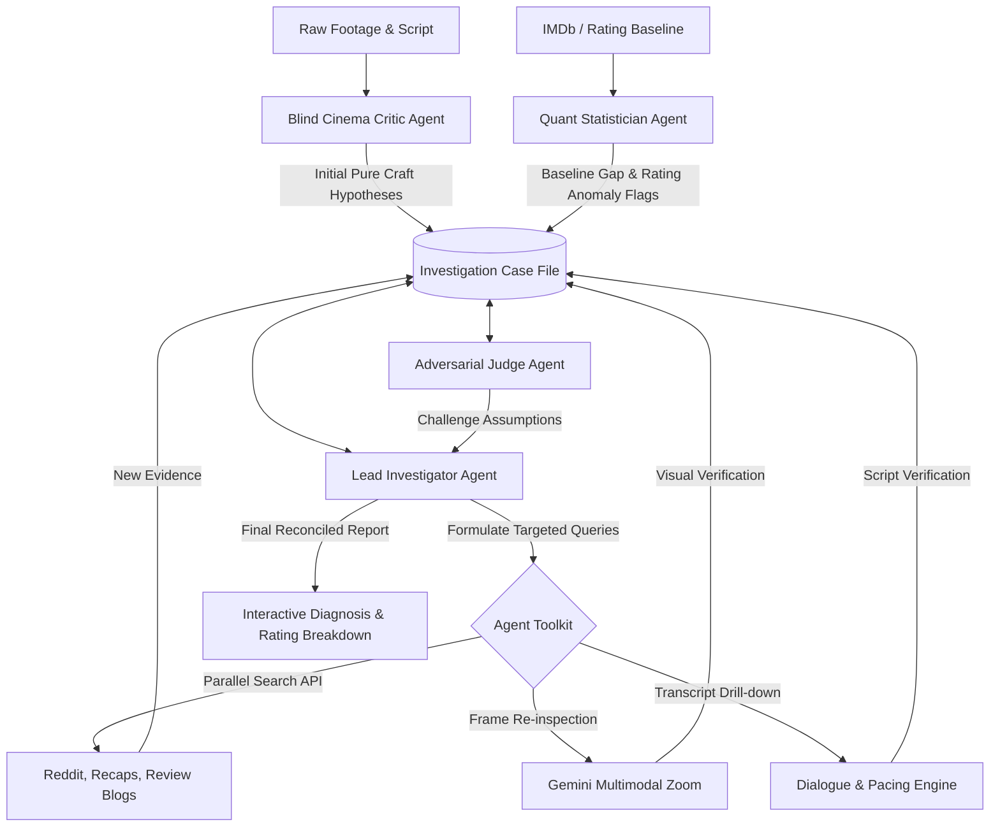

# 🎬 Agentic Cinema Detective

> **Explaining TV Episode Ratings through Autonomous Visual & Script Analysis Cross-Examined Against Audience Consensus**

---

## 📌 Project Overview

**Agentic Cinema Detective** is an autonomous AI multi-agent investigation system that watches television episodes (visual keyframes + aligned dialogue transcripts) to evaluate why an episode succeeded or failed relative to its historical expectations.

Instead of naively predicting ratings, the system:
1. **Calculates a Rating Residual**: Computes an expected baseline rating based on episode position (premiere/mid-season/finale), season mean, and series historical performance, isolating the *residual craft variance* ($Rating_{actual} - Rating_{expected}$).
2. **Conducts a Blind Craft Analysis**: Evaluates shot pacing, visual composition/lighting, dialogue density, and scene dynamics *without* anchor bias (no prior knowledge of public ratings).
3. **Executes Dynamic Parallel Web Research**: Uses the **Parallel Search API** to investigate crowd reaction across Reddit, recaps, review blogs, and audience commentary.
4. **Evaluates & Reconciles**: Normalizes agent critiques and audience claims into a unified **Claim Taxonomy** (`Pacing`, `Cinematography`, `Acting`, `Plot Logic`, `Payoff`) to compute an objective agreement score and explain discrepancies (e.g., review bombing, visual broadcast issues, subverted expectations).

---

## 🚀 Ingestion Pipeline (`shot_pipeline`)

The ingestion pipeline detects shot transitions using PySceneDetect, extracts midpoint keyframes, parses aligned dialogue transcripts (`.srt` or Whisper AI), and packages the final feature store.

### Run Auto-Discovery Across `data/`
```bash
python shot_pipeline.py
```

### Run on a Specific Video File
```bash
python scripts/run_shot_pipeline.py --video data/space/space.mp4 --output-dir data/space --srt data/space/space.srt --threshold 50.0
```

#### Outputs Generated per Episode:
* 📸 **Keyframe Images**: `data/<folder>/keyframes/shot_XXXX.jpg`
* 📜 **Shot Manifest**: `data/<folder>/shot_manifest.json` (timestamps, frames, aligned dialogue)
* 💬 **Transcript File**: `data/<folder>/transcript.json`
* 📦 **Master Feature Store**: `data/<folder>/episode_features.json`

---

## 🏗️ Multi-Agent Architecture



### Isolated Agent Roles
* **🙈 Blind Cinema Critic**: Analyzes raw shot keyframes + transcript slices without rating knowledge.
* **📊 Quant Statistician**: Computes rating baseline expectations and flags bimodal score distributions / review bombing.
* **🕵️ Lead Investigator & Parallel Sleuth**: Formulates hypotheses and autonomously executes tool calls (Parallel Search API, frame zoom, pacing analysis) to gather audience evidence.
* **⚔️ Adversarial Judge**: Challenges agent assumptions before finalizing conclusions.

---

## 📅 9-Day Hackathon Build Plan

Below is the day-by-day execution roadmap leading to submission:

### **Phase 1: Foundation & Data Pipeline (Days 1–2)**
- **Day 1: Ingestion & Shot Boundary Detection**
  - Set up repository structure and Python backend environment.
  - Implement `scenedetect` (`PySceneDetect`) and `ffmpeg` keyframe extraction.
  - Build subtitle (SRT/VTT) timestamp alignment script.
  - Run Gemini 2.0 Flash batch processing to output structured shot logs (`episode_features.json`).
- **Day 2: Rating Baseline & Residual Model**
  - Integrate IMDb / TMDB API metadata fetcher.
  - Build baseline rating regression model ($Rating_{expected} = f(\text{show\_mean}, \text{season\_position}, \text{finale\_flag}, \text{vote\_count})$).
  - Compute rating residual ($Rating_{actual} - Rating_{expected}$) and generate baseline anomaly flags.

### **Phase 2: Parallel Search & Claim Taxonomy (Days 3–4)**
- **Day 3: Parallel Search API Integration**
  - Implement `Parallel Search API` client wrapper.
  - Create targeted search queries targeting Reddit discussions (`r/television`, show subreddits), IGN, AV Club recaps, and review comments.
  - Build search caching layer to optimize API credits during development.
- **Day 4: Claim Taxonomy Normalizer**
  - Define unified JSON Claim Taxonomy schema:
    ```json
    {
      "category": "Pacing | Cinematography | Acting | Plot Logic | Character Arc | Payoff",
      "valence": "positive | negative",
      "target": "Scene ID / Character Name / Arc",
      "evidence": "Detailed explanation..."
    }
    ```
  - Implement claim extraction prompts to convert unstructured web text and agent critiques into standardized claims.

### **Phase 3: Multi-Agent Engine & Tool Calling Loop (Days 5–6)**
- **Day 5: Investigator State Machine & Agent Toolkit**
  - Implement persistent `Investigation Case File` state board.
  - Build dynamic tool calling engine (`parallel_search_audience_claims`, `inspect_video_timestamp`, `query_script_pacing`, `fetch_rating_demographics`).
- **Day 6: Adversarial Debate & Reconciliation Loop**
  - Wire up **Blind Critic** $\leftrightarrow$ **Quant Statistician** $\leftrightarrow$ **Adversarial Judge** debate loop.
  - Implement self-correction logic when web search evidence contradicts initial visual hypotheses.
  - Build Ground Truth Evaluation Harness (Precision/Recall on craft critique alignment).

### **Phase 4: Frontend & Interactive Dashboard (Days 7–8)**
- **Day 7: Sleek Dashboard UI**
  - Build React + Vite dark-mode dashboard (glassmorphism aesthetic).
  - Create **Episode Timeline Strip** with shot keyframes and pacing intensity chart.
  - Render **Residual Gauge** ($Rating_{actual}$ vs $Rating_{expected}$).
  - Display interactive **Investigation Board** showing active hypotheses and evidence cards.
- **Day 8: Live Tool Stream & Interactive Steering**
  - Add real-time **Parallel Search Execution Log** (showing live web search queries executing).
  - Build **"Steer the Investigation"** prompt input box allowing live user/judge queries.
  - Perform end-to-end integration testing on 10+ pre-cached test episodes (*Game of Thrones*, *Succession*, *Breaking Bad*).

### **Phase 5: Polish, Verification & Pitch (Day 9)**
- **Day 9: Final Polish & Submission**
  - Verify compliance: **Zero copyrighted media files in repository** (pipeline code + JSON feature cache only).
  - Write comprehensive user guide and local setup instructions in `README.md`.
  - Record 2-minute pitch & demo video showcasing live Parallel search agent loop.
  - Submit repository to hackathon track!

---

## 🛠️ Technology Stack

* **Core Logic & Agents**: Python 3.11, FastAPI, LiteLLM / Gemini SDK
* **Web Search Engine**: **Parallel Search API** (`parallel-ai`)
* **Computer Vision & Video**: `PySceneDetect`, `ffmpeg`, Gemini 2.0 Flash (Multimodal)
* **Frontend**: React, Vite, Vanilla CSS, Recharts, Lucide Icons
* **Data Storage**: SQLite & JSON file cache

---

## ⚖️ Rights & Copyright Compliance

This repository contains **zero copyrighted video files or raw frames**. The codebase provides the ingestion pipeline code alongside derived text descriptions and embeddings (`episode_features.json`). Users can run the extraction pipeline against their own locally owned media files.
