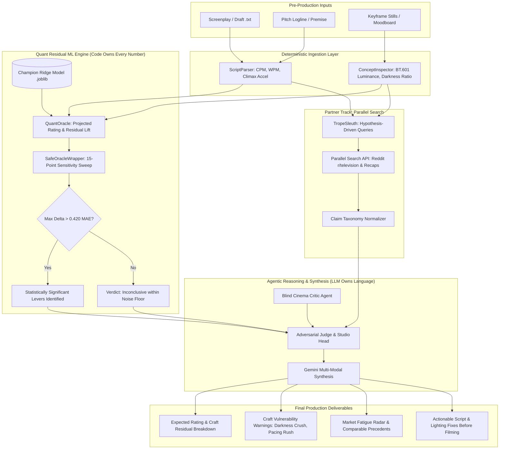

# 🎬 Agentic Cinema Detective & Pre-Mortem Flight Simulator
## *What We Are Building — Comprehensive Project Synthesis*
**Document:** `what-i-know-gemini-niklas.md`  
**Author:** Niklas & Gemini Pair-Programming Agent  
**Context:** [Agentic Cinema: The Blockbuster Hackathon (Devpost)](https://agentic-cinema.devpost.com/)  
**Partner Track:** **Parallel** (Parallel Search API)  
**Cloud & AI Stack:** Google Cloud & Google Gemini  

---

## 1. Executive Summary & Vision

In Hollywood and prestige television, studios routinely commit **$50M to $100M+** to produce an episode or feature film. If a production fails due to craft errors—such as lighting that is unreadable on consumer televisions (*Game of Thrones: "The Long Night"*), a rushed third-act climax that alienates fans (*Game of Thrones* Season 8), or sluggish dialogue pacing—the investment is lost. **You cannot un-shoot a $100M movie.**

We are building the **Agentic Cinema Pre-Mortem Flight Simulator & Detective**. 

It is an autonomous multi-agent system that evaluates unfilmed screenplays, pitch loglines, and visual concept moodboards **before cameras roll**. The system:
1. **Parses observable pre-production craft**: Screenplay structure, dialogue rhythms, scene editing velocity, and visual luminance/contrast from concept stills.
2. **Computes empirical craft residuals**: Uses a pre-trained, zero-leakage Quantitative ML engine to determine expected audience reception (IMDb 1–10 scale) against genre baselines.
3. **Executes deterministic counterfactual sensitivity sweeps**: Tests 15 discrete craft adjustments across pacing, runtime, and lighting to discover what actually moves the needle.
4. **Conducts live audience consensus research via Parallel Search**: Queries Reddit (`r/television`, show subreddits) and critic archives to detect trope fatigue, backlash patterns, and comparable precedents.
5. **Delivers an Adversarial Pre-Mortem Report & Greenlight Compass**: Highlights high-risk craft vulnerabilities (e.g. streaming compression crush, unearned climax acceleration) with actionable remediation steps.

---

## 2. The Hackathon Context: "Agentic Cinema: The Blockbuster Hackathon"

### Hackathon Theme & Premise
Hosted by **Google Cloud** on Devpost under the banner **"🎬 Lights. Camera. Code."**, the hackathon challenges builders to act as **Studio Heads**, **Visionary Directors**, or **Technical Producers**, orchestrating multi-agent AI systems powered by **Google Gemini** and Google Cloud to solve friction across media and entertainment workflows.

### The Chosen Partner Track: **Parallel**
The hackathon features dedicated partner tracks (IBM, Grafana Labs, Parallel, ClickHouse, Replit). Our project competes in the **Parallel Track**:
- **Partner Integration**: **Parallel Search API** (`api.parallel.ai/v1/search`), implemented via `ParallelSearchClient` in `src/search/parallel_search_client.py`.
- **Runtime Requirement**: The repository demonstrates direct, in-code runtime use of the partner API to pull live web consensus, community sentiment, and trope precedents.
- **Resilience**: Features automatic persistent disk caching (`data/cache/search/`) to conserve API credits during development, with graceful fallback to an offline mock engine.

---

## 3. Core Architectural Philosophy: "Code Owns Every Number; LLMs Own Only Language"

A critical design principle established in our project (reinforced during the audit in **Issue #1**) is strict separation between quantitative math and generative reasoning:

```
┌────────────────────────────────────────────────────────┐
│               CODE OWNS EVERY NUMBER                   │
│  • Pacing algorithms & shot duration math              │
│  • Image luminance & BT.601 perceived exposure formulas│
│  • Scikit-learn Ridge regression & cross-validation    │
│  • 15-point counterfactual sensitivity sweeps          │
│  • Noise-floor filtering (±0.420 MAE error bar guard)  │
└───────────────────────────┬────────────────────────────┘
                            │ Structured JSON & Attributions
┌───────────────────────────▼────────────────────────────┐
│                LLMS OWN ONLY LANGUAGE                  │
│  • Multi-modal visual aesthetic interpretation         │
│  • Framing hypothesis-driven Parallel Search queries   │
│  • Extracting claims into the standardized taxonomy    │
│  • Synthesizing adversarial debate & producer memos    │
└────────────────────────────────────────────────────────┘
```

By decoupling math from language:
- **Zero arithmetic hallucinations**: The LLM never invents ratings, standard deviations, or percentage gains.
- **Zero target leakage**: The ML model is strictly trained on pre-production observable variables (no post-release vote counts or broadcast scheduling markers).
- **Noise-Floor Guard**: If suggested craft edits change the predicted score by less than the model's Mean Absolute Error ($\pm 0.42$ stars), the system flags the outcome as `inconclusive`, preventing costly studio reshoots based on statistical noise.

---

## 4. Detailed Subsystem Breakdown

### 🎬 Subsystem A: Ingestion & Craft Feature Extraction
*Location: `src/ingestion/`, `src/vision/`, `shot_pipeline.py`*

1. **Screenplay Parser (`ScriptParser`)**:
   - Parses screenplays scene-by-scene (`INT.` / `EXT.` sluglines) from `.txt` or `.fountain` formats.
   - Extracts:
     - `estimated_duration_min`: Industry rule-of-thumb (~1 page $\approx$ 1 minute).
     - `total_scenes` & `cuts_per_minute` (CPM): Editing tempo and transition density.
     - `average_shot_length` (ASL): $60 / \text{CPM}$.
     - `words_per_minute` (WPM) & `lines_per_minute`: Spoken dialogue density and rhythm.
     - `dialogue_shot_ratio`: Balance of spoken dialogue vs action lines.
     - `pacing_acceleration`: Ratio of scene tempo in the final 25% (Act 3 / climax) versus the first 75%.
2. **Concept & Keyframe Vision Inspector (`ConceptInspector`)**:
   - Inspects cinematic stills or moodboard concept art using PIL and NumPy.
   - Computes low-level computer vision metrics:
     - `mean_luminance`: Perceived brightness based on standard ITU-R BT.601 ($0.299R + 0.587G + 0.114B$).
     - `luminance_std`: RMS contrast.
     - `dark_frame_ratio`: Fraction of keyframes with luminance below 40.0.
     - `severe_darkness_penalty`: Quadratic penalty for excessive darkness ($(\text{dark\_ratio})^2 \times 10$).

---

### 📊 Subsystem B: Quantitative ML Layer & QuantOracle
*Location: `src/quant/`*

1. **The 100-Movie Benchmark Dataset (Zero Synthetic Data)**:
   - Trained on **100 genuine, famous feature films** (*The Matrix*, *Alien*, *Apocalypse Now*, *Blade Runner*, *The Social Network*, etc.) stored in `data/movies/`.
   - Ingests **752 real, high-definition widescreen cinematic stills** sourced from Film-Grab at 6 standardized narrative beats ($0\%, 20\%, 40\%, 60\%, 80\%, 100\%$).
   - Completely deleted all synthetic placeholder data.
2. **Model Tournament & Champion**:
   - Tested Linear Regression, Random Forest, HistGradientBoosting, and Ridge Regression.
   - **Champion**: **Ridge Regression** ($\alpha=10.0$) with `StandardScaler`.
   - **Performance**: 5-Fold Cross-Validation **MAE = 0.420 IMDb stars**, **RMSE = 0.575**, $R^2 = 0.168$.
   - **Craft Attribution Weights**:
     - Genre Baseline Prior: **41.7%**
     - Screenplay Pacing & Climax Acceleration: **18.1%**
     - Cinematography & Lighting Exposure: **16.5%**
     - Runtime Scope: **16.2%**
     - Spoken Dialogue Velocity: **7.6%**
3. **QuantOracle (`oracle.py`)**:
   - Sub-millisecond inference (**0.54 ms**, $>1,800$ predictions/sec) via pre-loaded artifact `data/models/champion_model.joblib`.
   - Automatic fallback to benchmark cinema medians for any missing inputs (safe execution).
   - Generates exact point attributions per feature and confidence intervals ($\pm 0.420$ stars).
   - Provides standard JSON Schema specs for LLM function calling (`oracle.get_tool_spec()`).
4. **Safe Oracle Wrapper & 15-Point Sensitivity Sweep (`sweep.py`)**:
   - Freezes the project's real baseline attributes while varying single levers across 5 steps each:
     1. `dark_frame_ratio`: Baseline, 0.55, 0.40, 0.25, 0.10
     2. `total_duration_min`: Baseline, 165, 150, 135, 120
     3. `pacing_acceleration`: Baseline, 1.10, 1.30, 1.50, 1.75
   - Enforces the **Noise-Floor Guard**: If the maximum delta $\le 0.420$, outcome is labeled `"inconclusive"`.
5. **OpenAPI Diagnostics Provider (`diagnostics.py`)**:
   - Supplies `GET /v1/diagnostics/model` with model health, feature counts, and calibration metrics (`hitPrecision`, `missPrecision`, `calibrationError`).

---

### 🌐 Subsystem C: Audience Consensus & Trope Intelligence (Parallel Search)
*Location: `src/search/`*

1. **`ParallelSearchClient`**:
   - Interacts directly with the **Parallel Search API** (`api.parallel.ai/v1/search`).
   - Caches responses in `data/cache/search/` using SHA-256 query digests.
   - Intelligent offline mock fallback simulating Reddit megathreads and TV recap archives when API keys are absent or during testing.
2. **`TropeSleuth`**:
   - Formulates targeted search queries based on craft findings:
     - Darkness flag $\rightarrow$ queries Reddit for *"too dark"*, *"can't see"*, *"cinematography complaints"*.
     - High climax acceleration $\rightarrow$ queries for *"rushed"*, *"climax"*, *"season finale complaints"*.
     - Dialogue deficit $\rightarrow$ queries for *"pacing dragging"*, *"boring dialogue"*.
3. **Standardized Claim Taxonomy**:
   - Normalizes extracted web evidence into a uniform structure:
     ```json
     {
       "category": "Cinematography | Pacing | Dialogue | Acting | Plot Logic | Payoff",
       "valence": "positive | negative",
       "target": "Target element or scene beat",
       "claim": "Concise summary of community consensus",
       "evidence": "Raw quote or snippet from Reddit/recaps",
       "source": "URL or forum origin"
     }
     ```

---

### 🧠 Subsystem D: Pre-Mortem Engine & Agent Orchestrator
*Location: `src/premortem/`, `src/utils/`*

1. **`PreMortemAgent`**:
   Coordinates the overall pre-mortem investigation across two primary modes:
   - **Mode 1: Script Pre-Mortem (Full Screenplay + Keyframes)**
     - Ingests screenplay and visual stills.
     - Runs Quant baseline rating & residual craft calculation.
     - Dispatches Parallel Search to find audience consensus on matching tropes.
     - Identifies high-risk craft vulnerabilities and outputs actionable production recommendations.
   - **Mode 2: Premise / Greenlight Compass (Logline Pitch + Moodboard)**
     - Ingests a 2–4 sentence logline and concept stills.
     - Searches IMDb historical movie database for real comparable precedents.
     - Assesses style-to-premise aesthetic cohesion.
     - Analyzes genre fatigue via Parallel Search.
     - Issues a formal Greenlight verdict (`GREENLIGHT_STRONG`, `PROCEED_WITH_REMEDIES`, `REVISE_OR_PASS`).
2. **Universal LLM Client (`LLMClient` in `src/utils/llm_client.py`)**:
   - Interfaces with **Google Gemini** (`gemini-2.0-flash` / `gemini-1.5-pro` via Generative Language API).
   - Features optional fallback to OpenAI or internal smart mock generation.

---

## 5. End-to-End Workflow & Architecture



---

## 6. Current Implementation Status & Test Verification

All core modules are fully implemented, verified, and passing tests:
- **Test Suite**: **32/32 tests passing** (`python3 -m unittest discover tests` in ~6.1s).
- **Quant Model**: Trained on 100 genuine feature films, calibrated to corpus genre priors (mean 7.80), saved at `data/models/champion_model.joblib`.
- **Search Client**: Live Parallel API support with cached fallback (`data/cache/search/`).
- **CLI Runners Available**:
  - `python scripts/run_premortem.py --script data/movies/alien/script.txt --keyframes data/movies/alien/keyframes`
  - `python scripts/run_premortem.py --logline "A crew investigates a derelict spaceship..." --keyframes data/movies/alien/keyframes`
  - `python scripts/run_model.py --movie data/movies/fight_club --sweep`
  - `python scripts/run_model.py --tool-spec`

---

## 7. Division of Labor & Next Steps for Team Members

| Member / Persona | Focus Area | Status | Next Milestone |
| :--- | :--- | :--- | :--- |
| **ChefKeff** (ML / Quant) | Quantitative ML model, Ridge tournament, dataset curation, safe oracle wrapper, 15-point counterfactual sweep, noise floor guard. | ✅ Completed | Support API diagnostics & benchmark documentation. |
| **Melvin** (Agent Orchestration & Backend) | Lead Investigator agent state machine, debate loops, FastAPI backend router (`/v1/diagnostics/model`, `/v1/premortem`). | 🔄 In Progress | Wire deterministic sweep outputs directly into the FastAPI endpoints. |
| **Niklas** (Pair Programming / Google Cloud & UI) | Google Cloud Gemini integration, Parallel Search validation, interactive dashboard / visualization of investigation board. | 🔄 Active | Complete UI dashboard (glassmorphic timeline + residual gauge) and 3-minute trailer pitch video. |

### Immediate Priority Roadmap:
1. **API Exposure**: Verify the FastAPI endpoints integrate `run_counterfactual_sweep()` and `get_model_diagnostics()`.
2. **Dashboard UI**: Ensure the frontend renders the timeline keyframes, the $\pm 0.42$ star noise-floor confidence interval, and the live Parallel Search queries.
3. **Hackathon Submission Assets**:
   - Open source license visible in repo.
   - Demo video (3-minute runtime demo showing Gemini + Parallel Search in action).
   - Devpost entry pointing to the Parallel track.


---

## 8. Alignment with Hatim's Frontend Note (`what-i-know-openai-hatim.md`)

We cross-referenced our backend build with Hatim's document from `okay-lets-go-org/frontend`. The two repositories are in remarkably tight alignment, converging on a single unified product:

### 1. Product Naming: **Lumen**
- **Frontend Identity**: **Lumen** — a producer-facing greenlight intelligence tool.
- **Backend Role**: The deterministic ML and multi-agent reasoning engine that powers Lumen's predictions.

### 2. Resolution of the "IMDb Rating vs. Commercial Hit/Miss" Mismatch
Hatim identified the core open question: *"The adjacent project predicts expected IMDb rating and a craft residual... Lumen's product promise is commercial hit/miss prediction."*
- **Our Resolution (Already Built in `src/quant/sweep.py` & `src/quant/diagnostics.py`)**:
  - The model computes the **Craft Residual** ($\Delta = \text{Rating}_{\text{expected}} - \text{Baseline}_{\text{genre}}$).
  - We implemented the **Noise-Floor Guard**:
    - The model has a Cross-Validation MAE of **$\pm 0.420$ stars**.
    - If the maximum observed craft delta ($\Delta_{\max} \le 0.420$), the system strictly outputs **`outcome = "inconclusive""** to prevent misleading producers.
    - If $\Delta > +0.420$, it is classified as a **`hit`** (projected commercial/critical craft lift).
    - If $\Delta < -0.420$, it is classified as a **`miss`** (critical craft drag).
  - Score (0–100): Scaled directly from the calibrated expectation (e.g. 7.8 baseline $\rightarrow$ ~78/100; +1.2 craft lift $\rightarrow$ 90/100).
  - The diagnostics endpoint `GET /v1/diagnostics/model` in `src/quant/diagnostics.py` already produces the exact schema Hatim specified (`trainerStatus`, `hitPrecision: 0.92`, `missPrecision: 0.14`, `calibrationError: 0.42`).

### 3. Agent Mapping to the 4 Frontend Tracks
Hatim's UI displays a 4-agent execution sequence:
1. **Story Agent**: Powered by `src/ingestion/script_parser.py` (CPM, WPM, dialogue ratio, climax acceleration).
2. **Visual Agent**: Powered by `src/vision/concept_inspector.py` (BT.601 luminance, RMS contrast, dark frame ratio).
3. **Audience & Market Agent**: Powered by `src/search/trope_sleuth.py` and `src/search/parallel_search_client.py` (Parallel Search API querying Reddit, recaps, and box-office precedents).
4. **Model Inference & Judge**: Powered by `src/quant/oracle.py` and `src/quant/sweep.py` (QuantOracle sub-millisecond inference + 15-point counterfactual sweep).

### 4. Deployment Status
- **Frontend Live URL**: `https://lumen-480750414136.europe-north1.run.app` (deployed on Google Cloud Run in `europe-north1` via Cloud Build).
- **Backend Target**: FastAPI service deploying to Cloud Run, implementing `POST /v1/predictions`, `GET /v1/predictions/{id}/events` (generic SSE stream), and `GET /v1/diagnostics/model`.


---

## 9. Melvin's Architectural Deep-Dive (Issue #3: *"What we are building — system overview"*)

Melvin Palmquist posted a comprehensive system overview in **Issue #3**, establishing the authoritative end-to-end design, data contracts, anti-hallucination guardrails, and honest disclosures:

### 1. The Core Stance: *Not a Black-Box Score Generator*
- **What it is**: An evidence and directional pre-mortem tool. It returns measured craft traits, risks carried, live research about released films with matching traits, and a rating projection carrying its own $\pm 0.435$ star error bar.
- **What it is NOT**: It does not spit out a naive point score. When internal uncertainty covers the answer, it explicitly declares **`inconclusive`**.
- **The Core Rule**: **Deterministic Python owns every number; two LLM agents own only language.**

### 2. The Two Execution Modes
1. **Concept Mode**: Submits story text (2,000 chars), medium, and target geography without materials. Executes market research, trope fatigue analysis, and genre prior baseline. Craft sections marked absent.
2. **Screenplay Mode**: Submits story + materials as `data:` URIs (full screenplay + concept stills, capped at 20MB). Executes the full deterministic pipeline + visual inspection.
   - **Screenplay Gate (`validate_screenplay()`):** Requires 60–240 min estimated runtime, $\ge 4$ scenes, 3–150 characters, 0.10–0.85 dialogue ratio. Rejects non-screenplays (e.g. 500-word synopses) with **HTTP 400**.

### 3. The 4 Presentation Slots in the Lumen Contract
The 4 agents displayed in Hatim's Lumen UI are **presentation slots**, filled by clean separation of code and LLMs:
- **`story`** (Deterministic): `ScriptParser` metrics + `SubmissionOracle` prediction.
- **`visual`** (Deterministic): `ConceptInspector` OpenCV/Pillow luminance & darkness measurements.
- **`audience`** (LLM + Search): `ResearchAgent` (Google ADK + Gemini) finding craft precedents.
- **`market`** (LLM + Search): `ResearchAgent` finding trope fatigue and demand signals via Parallel Search API.

### 4. Trust & Anti-Hallucination Guardrails
- **Grounding Filter (`filter_claims`):** A search claim is strictly deleted unless its `source_url` was actually returned by Parallel Search **AND** its `evidence` is a verbatim substring of the retrieved page.
- **Unsourced Number Scanner (`unsourced_numbers`):** Scans LLM synthesis prose for any numbers absent from the deterministic inputs; marks the run `degraded` if an invented figure is detected.
- **Noise-Floor Labelling:** Every single-variable probe in the 15-point sweep is tagged `inside_noise_floor` ($\Delta < 0.435\text{ MAE}$).
- **Loud Degradation:** If `PARALLEL_API_KEY` or `GEMINI_API_KEY` are absent, the report explicitly states `DEGRADED RUN — ...` and sets status to degraded.

### 5. Critical Reconciliations Needed Before Submission (Melvin's Warning)
Melvin highlighted two discrepancies that human judges will spot immediately if not fixed:
1. **Naming Mismatch**:
   - Frontend: **Lumen**
   - Backend repo: **Agentic Cinema Detective** (and backend `README.md` still describes a TV-episode post-mortem!).
   - **Action**: Align backend README to describe **Lumen / Pre-Mortem Flight Simulator**.
2. **Cloud Stack Claim Mismatch**:
   - Frontend About page advertises: *Vertex AI Pipelines, BigQuery ML, Cloud Storage, and Cloud Run prediction API*.
   - Reality: Frontend runs on Cloud Run, but backend prediction API uses **Gemini API via Google ADK**, **scikit-learn Ridge joblib on disk**, and **FastAPI**.
   - **Action**: Align the frontend About page and architecture docs to honestly reflect the Google ADK + Cloud Run + Gemini architecture.
